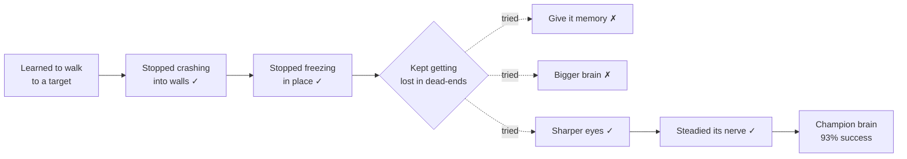
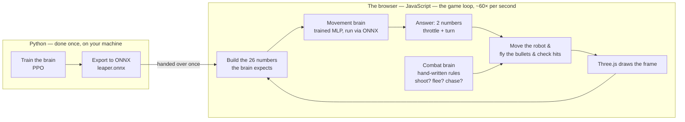
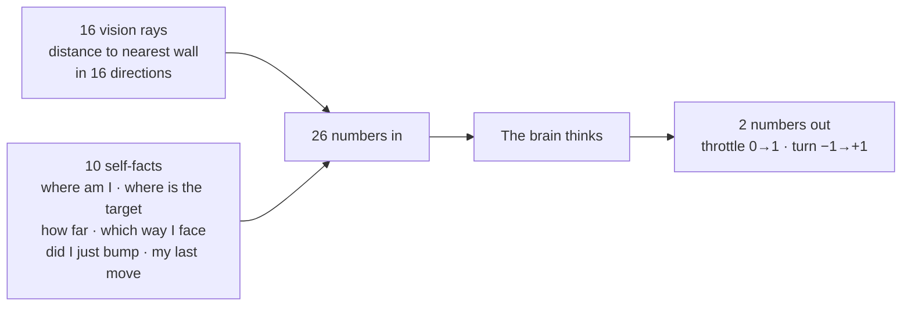

# From Maze to Arena

**Building a playable web game around a robot that taught itself to move.**

The Leaper is a six-legged robot that learned, on its own, to walk through a cluttered arena and reach a target — no route ever handed to it. That part works. The next step is to build a game around it: one you play in a web browser, where the Leaper becomes an opponent that chases and shoots, and can be shot back until it falls apart leg by leg.

What follows traces the full arc in four stages — where the Leaper started, where it stands today, where we're taking it, and how the game is put together.

---

## Stage One — Where we started

The whole project began with one stubborn goal: teach the robot to **walk to a target on its own**, through a space full of obstacles, without being told the way. We didn't hand-write the movement. We used Reinforcement Learning (RL): the robot tried, failed, and slowly kept whatever worked — hundreds of thousands of times over — until good movement emerged by itself. The specific training method was Proximal Policy Optimization (PPO).

That journey had a clear shape, and it explains why the brain is what it is today. The easy problems fell first. Then one problem held on for weeks — and the way we finally cracked it became the most important lesson of the whole project.

Crashing and freezing were solved early. Then the robot kept **getting lost** — walking into dead-ends and running out of time. We first tried to make it *think* harder: we gave it memory (a Long Short-Term Memory, or LSTM, add-on) and, separately, a bigger brain. Neither helped. What finally worked was letting it *see* better — doubling its eyesight. That, plus steadying its confidence, gave us today's champion.

The lesson underneath shapes everything ahead: **the robot's limits came from what it could see, not how hard it could think.** We'll lean on the brain for the one thing it's genuinely brilliant at — moving — and hand every other job to simpler tools.

---

## Stage Two — Where we are now

Today we hold two things.

The first is a **finished, capable brain** — the champion, a Multi-Layer Perceptron (MLP) network trained with PPO that reaches its target about **93%** of the time, steering confidently around obstacles across a wide 270-degree field of view. It's small, fast, and — by design — has no memory, which makes it far easier to carry into a browser.

The second is a **web project already written in JavaScript**, using a library called Three.js to draw the robot and its world in 3D inside an ordinary browser. The graphics foundation is already built. There's no "switch to another language" ahead of us — the game is already in the language of the web.

For a long time there was one honest gap between these two — and it has now been closed. The browser used to only play back a **recording**, a large file Python made earlier, like a video of the robot moving. Perfect for studying the training, but you can't play against a recording; it never reacts. **That gap is gone.** The trained brain now runs *live* in the browser: every fraction of a second it looks at the world and decides for itself, exactly as it did in training — no recording involved. And it's already published as a web page anyone can open by a link, the robot thinking on their own computer. How that was done is Stage Four; what it unlocks next is Stage Three.

---

## Stage Three — Where we're going

The destination is a **web-based game** — one that runs in any browser, with no app to install. Part of it already exists; the rest is the fun still ahead.

**Already standing today:**

- **Built in JavaScript, running on the web.** The same language and the same Three.js graphics all along. It's live now — anyone can open it with a link, and the Leaper walks itself around obstacles to its target on their screen.

**What's still ahead — turning the demo into a game:**

- **A human player you control.** Move with the keyboard, aim with the mouse — you're in the arena, not watching it.
- **Shooting, both ways.** The Leaper fires at you using its trained brain to hunt you down; you fire back at it.
- **Visible damage.** Because the Leaper is built from six separate legs, you can *see* it come apart as you hit it — a leg blows off, its walk turns to a limp, sparks fly, until it finally collapses.
- **One-on-one to start.** One human versus one Leaper. A friend on the same screen — and, much later, online play — are optional add-ons for once the core game feels good.

The important thing: the hard, uncertain part — *does the real brain survive the trip into a browser and still drive well?* — is now proven done. Everything left is game-building on top of a brain that already works.

---

## Stage Four — How the game fits together

Here is the architecture: the shape of how every piece works together. The idea that makes it all manageable is a clean division of labour — **the trained brain does the one thing it's brilliant at (moving), and simple hand-written rules do the fighting.** Nothing is asked to do a job it wasn't built for.

### The map

Read it left to right. Python trains the brain and exports it **once** to a single file, then steps out of the picture entirely. Everything else lives in the browser and repeats about sixty times a second: gather what the brain needs to see, let it decide where to step, let the combat rules decide whether to shoot or flee, apply both, move the bullets, check the hits, and draw the frame — then do it all again.

### The one careful step: waking the brain up

Getting the brain from Python into the browser is the crux of the entire project. We export it once to an ONNX (Open Neural Network Exchange) file — the universal brain-format that browsers can read — and run it live with a small library.

The brain expects to be handed **26 numbers** every frame and answers with **2**:

The single make-or-break detail: those 26 numbers must be built in JavaScript in **exactly** the same order and scale that Python used during training. Get it right and the live brain moves just like the trained one. Get it subtly wrong and it behaves as if dizzy. That faithfulness *is* the real work of this step — it isn't difficult, it simply has to be precise.

### Why the split matters

Remember the lesson from Stage One: the brain is a brilliant *mover*, but it was never taught to *fight*. So we don't ask it to. It handles movement; a few plain rules handle combat. This is the same wisdom that ended the memory experiments — use each tool for the job it's actually good at, and nothing for a job it isn't.

---

## The combat brain, up close

The Leaper's fighting decisions need no training at all — we simply write them, in the simplest form that works, and reach for something fancier only when the game shows us we need it. This is a two-step plan on purpose.

### Step one — the behavior tree (a plain checklist)

A **behavior tree** is a plain "if this, then that" checklist. It runs top to bottom every single frame and does the first thing that's true:

> 1. Am I hurt? → **flee.**
> 2. Is the player in range? → **shoot.**
> 3. Otherwise → **chase** (hand control back to the movement brain).

That's the whole combat brain, and for most of the game it's all we'll ever need. Notice the clean handoff: the first two lines are the fighting; the last line simply gives the wheel back to the trained brain to do the chasing.

### Step two — the state machine (only if the checklist isn't enough)

A plain checklist has one blind spot: it **forgets what it was just doing.** It decides fresh every frame, with no sense of "I'm in the middle of something." A state machine (also called a Finite State Machine, or FSM) fixes that by putting the Leaper *in a mode* and making it *stay there* until a specific thing changes. Two situations make that worth it:

- **The twitching problem.** If the player dances right at the edge of shooting range — stepping in, out, in, out — the plain checklist flickers *shoot, chase, shoot, chase* many times a second, because each frame it forgets it was just shooting. A state machine commits instead: "I've entered **Shooting** mode, and I'll stay there until the player is *clearly* out of range" — so it stops flip-flopping over a tiny wobble.

- **The longer-action problem.** Some actions take *time* and must be allowed to play out. Picture the Leaper **reloading**: once it starts, it should be locked into reloading for a couple of seconds, even if you charge at it. Or a **charge attack** that goes wind-up → dash → recover, three phases in order. A checklist, deciding fresh every frame, has no natural way to stay committed to something that takes time. A state machine does it effortlessly, because it simply remembers "I'm in **Reloading** mode right now, and I don't leave until the timer is done."

**The plan in a sentence:** build the behavior-tree checklist first — it's the clearest place to start and handles most of the game. The day the Leaper starts twitching at the edge of range, or the day we add an action that takes time, that's the signal to give *that one behavior* the small memory of a state machine. Not before. The two aren't rivals — the common setup is a state machine for the big modes with a little checklist living inside each.

---

## The shape of it all

We **started** by teaching a robot to move with reinforcement learning, and learned — the hard way, through the memory experiments — that its power is in *moving*, not in thinking harder. We **carried** that finished brain out of Python, through a single ONNX file, and into an ordinary web page, where it now runs live: looking, deciding, and walking itself to its target sixty times a second — and it's published online for anyone to open. We proved it faithful with a self-test that checks the browser brain gives the identical answers the trained one did. What's **left** is to make it a game around that living brain — a human player, shooting both ways, the Leaper coming apart leg by leg — layering plain combat rules on top, a behavior-tree checklist first, a state machine only where the Leaper needs to remember what it's doing.

The hard, uncertain part is done. From here it's a series of small, visible, playable steps. That's the road from maze to arena.
